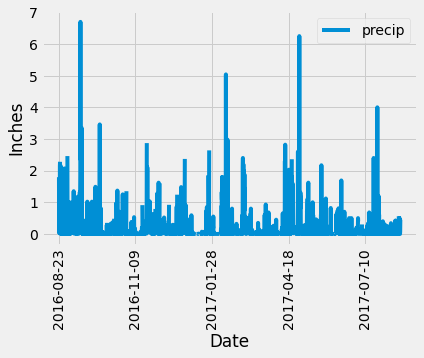
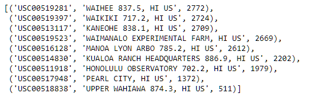
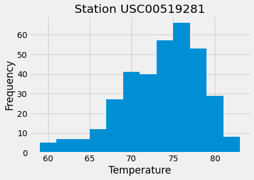

# Prompt
Use Python and SQLAlchemy to do basic climate analysis and data exploration of the provided climate database. All of the following analysis should be completed using SQLAlchemy ORM queries, Pandas, and Matplotlib. After this analysis is done create a flask app to display the results.

# Process

### Dependencies 
- Python
- SQL Alchemy
- Pandas
- Matplotlib
- Flask

1. Database Connection  
        SQL ALchemy will be used to connect to the provided sqlite database. The `create_engine()` function will act as the bridge to the sqlite database. For the purposes of this project the database is stored locally. Once the location of the database is referenced it can be transformed into a model that python can work with using `automap_base()` and `prepare(engine, reflect=True)`. Automap reads the sqlite database and generates classes. To make future uses of these classes easier they are saved to variable as such:
        ```
        m = Base.classes.measurement
        s = Base.classes.station
        ```
1. Climate Analysis

      - Precipitation Analysis  
        Using datetime we can do calculations and analysis of the past twelve months. To do this take the last date in the dataset and subtract it from 366 days. This will limit the data to the past year.
        ```
        last_date = session.query(m.date).order_by(m.date.desc()).first()[0]
        query_date = dt.datetime.strptime(last_date, '%Y-%m-%d') - dt.timedelta(days=366)
        ```
        Using a sqlalchemy orm query we can retrieve the data points for date and precipitation from that filtered dataset and then converting it to all dataframe will allow the data to be sorted by ascending value.

        ```
        df = pd.DataFrame(data, columns=['date', 'precip'])
        climate_df = df.sort_values(by = 'date', ascending= True)
        ```
        
      With the sorted dataframe a graph of the rainfall data can be created.

      

3. Station Analysis  
The following are points of interest for the stations in the dataset:
  - Total number of stations
  - Stations and observation counts in descending order
  - Which station has the highest number of observations?
  - Last 12 months of temperature observation data (TOBS)
  - Filter by the station with the highest number of observations.
  - Plot the results as a histogram with `bins=12`
The queries will all start with `session.query()` and then chain functions as necessary. In some cases arithmetic operations are need. This is accomplished using `func` and the required operation. For example with the first question the `func.count()` function will be used as such:
```
session.query(func.count(s.station)).first()[0]
```
The chain of functions can get quite complex. For example, to get the station with the most observations the following query is used:
```
session.query(m.station).filter(s.station == m.station).group_by(m.station).order_by(func.count(m.tobs).desc()).first()
```
Here we are using the class variables set up earlier. They the same as tables in a SQL database. Metadata about the number of observations are in one class and the station name are in another. A join will link the two data points together. `order_by()` will arrange the results as needed by since we're interested in a numerical count the count function is applied to the class that has the temperature counts. Since it is joined to station name both pieces of metadata will move together. `first()` just shows the first result that is returned. To show all the stations and their corresponding observation count the query needs to be slightly altered. The most important part is to end the query with `all()` instead of `first()` so that all results will be returned.
```
session.query(s.station, s.name, func.count(s.name)).filter(s.station == m.station).group_by(s.name).order_by(func.count(s.name).desc()).all()
```


Using a similar method as before we can convert the last 12 months of temperature data into a dataframe and graph it as a histogram


2. Flask App
Using the same queries developed in the previous component we can display the data in a flask app. The important consideration is setting up the routes correctly. That will look as such
```
@app.route("/api/v1.0/precipitation")
def precipitation():
```
The logic with the functions for each route will be the queries from before. To list all the data for each station the data called from the sqlite database needs to be converted to JSON. This is done using the `jsonify` function. The structure is defined using a list of dictionaries.

The same process from the jupyter notebook to connect to the database will be used in the flask app.
